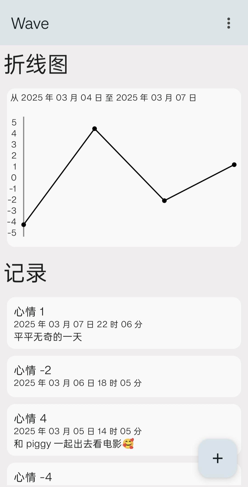
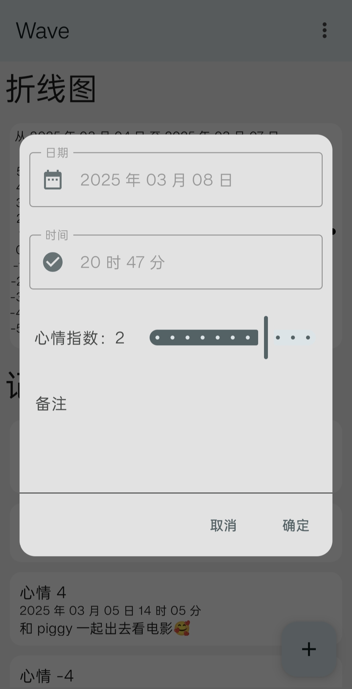
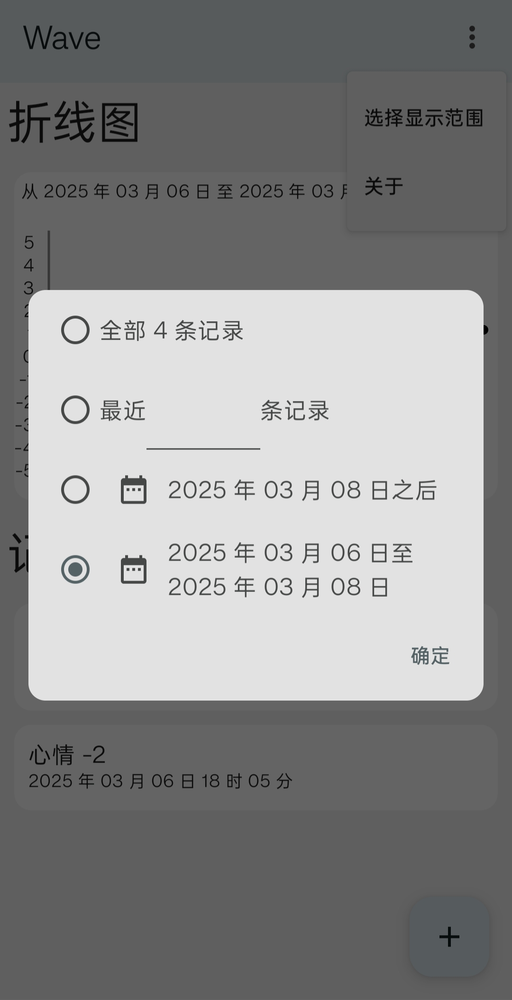

# Wave - Surf Your Emotional Journey 🌊

[](https://opensource.org/licenses/MIT)
[](https://github.com/AtomAlpaca/Wave/actions)
[](https://kotlinlang.org/)
[](https://github.com/AtomAlpaca/Wave/stargazers)

A lightweight Android app for tracking mood changes, developed using Jetpack Compose.

## 🌟 Features

|                           |                           |                           |
|---------------------------|---------------------------|---------------------------|
|  |  |  |

- Minimal UI design, crab your mood instantly
- Data filters, retrace your old memory
- Line Charts, up and downs clear at a glance
- Zero third-party trackers, your moods are only yours
  
## 🚀 Getting Started

### For Users

[](https://github.com/AtomAlpaca/Wave/releases/latest)

### For Developers

``` bash
git clone https://github.com/AtomAlpaca/Wave.git
./gradlew assembleDebug
adb install app/build/outputs/apk/debug/app-debug.apk
```

## 🛣️ Roadmap

- i18n
- Output as images/database
- Import Database
- Add support for wearable devices
- Emotional pattern analysis