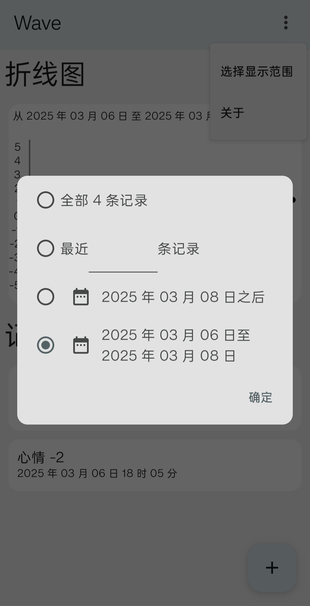

# Wave - 情绪冲浪日记 🌊

[](https://opensource.org/licenses/MIT)
[](https://github.com/AtomAlpaca/Wave/actions)
[](https://kotlinlang.org/)
[](https://github.com/AtomAlpaca/Wave/stargazers)

Wave 是一款基于 Jetpack Compose 开发的轻量级 Android 情绪追踪应用。

## 🌟 功能特性

|                           |                           |                           |
|---------------------------|---------------------------|---------------------------|
|  |  |  |

- **极简界面设计**：快速捕捉情绪波动
- **数据筛选功能**：回溯往昔心境变化
- **折线图表呈现**：情绪起伏一目了然
- **零第三方追踪**：数据完全本地存储

## 🚀 快速开始

### 用户指南

[](https://github.com/AtomAlpaca/Wave/releases/latest)

### 开发者指南

```bash
git clone https://github.com/AtomAlpaca/Wave.git
./gradlew assembleDebug
adb install app/build/outputs/apk/debug/app-debug.apk
```

## 🛣️ 开发路线

- 国际化支持（i18n）
- 以数据库形式导入导出
- 将记录导出为图片
- 智能手表、手环适配
- 情绪模式分析，基于AI生成行为建议